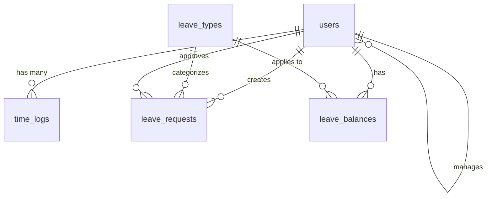

# เอกสารการออกแบบ

## ภาพรวม

ระบบลงเวลาและการจัดการวันลาพนักงานเป็นเว็บแอปพลิเคชันที่ออกแบบมาเพื่อใช้งานบนมือถือเป็นหลัก โดยใช้สถาปัตยกรรม MVC (Model-View-Controller) ด้วย PHP 8.0.30 และฐานข้อมูล MariaDB 10.6.19 ระบบจะมีการตอบสนองแบบ responsive design และใช้ AJAX สำหรับการโต้ตอบที่ราบรื่น

## สถาปัตยกรรม

### สถาปัตยกรรมระดับสูง

```
┌─────────────────┐    ┌─────────────────┐    ┌─────────────────┐
│   Frontend      │    │   Backend       │    │   Database      │
│   (HTML/CSS/JS) │◄──►│   (PHP 8.0.30)  │◄──►│   (MariaDB)     │
│   - Mobile UI   │    │   - MVC Pattern │    │   - Tables      │
│   - Responsive  │    │   - API Routes  │    │   - Relations   │
│   - AJAX        │    │   - Auth        │    │   - Indexes     │
└─────────────────┘    └─────────────────┘    └─────────────────┘
```

### โครงสร้างไดเรกทอรี

```
employee-leave-tracker/
├── public/
│   ├── index.php
│   ├── assets/
│   │   ├── css/
│   │   ├── js/
│   │   └── images/
├── src/
│   ├── Controllers/
│   ├── Models/
│   ├── Views/
│   ├── Services/
│   └── Config/
├── database/
│   └── migrations/
└── vendor/
```

## คอมโพเนนต์และอินเทอร์เฟซ

### Controllers

#### AuthController
- `login()` - จัดการการเข้าสู่ระบบ
- `logout()` - จัดการการออกจากระบบ
- `checkSession()` - ตรวจสอบเซสชัน

#### TimeTrackingController
- `clockIn()` - บันทึกเวลาเข้างาน
- `clockOut()` - บันทึกเวลาออกงาน
- `getTimeLog()` - ดึงประวัติการลงเวลา
- `getCurrentStatus()` - ตรวจสอบสถานะปัจจุบัน

#### LeaveController
- `createLeaveRequest()` - สร้างคำขอลา
- `getLeaveHistory()` - ดึงประวัติการลา
- `getLeaveBalance()` - ดึงยอดวันลาคงเหลือ
- `updateLeaveRequest()` - อัปเดตคำขอลา

#### ManagerController
- `getPendingRequests()` - ดึงคำขอที่รออนุมัติ
- `approveLeave()` - อนุมัติการลา
- `rejectLeave()` - ปฏิเสธการลา
- `getTeamOverview()` - ดูภาพรวมทีม

### Services

#### DatabaseService
- การเชื่อมต่อฐานข้อมูล
- การจัดการ prepared statements
- การจัดการ transactions

#### AuthService
- การยืนยันตัวตน
- การจัดการเซสชัน
- การตรวจสอบสิทธิ์

#### NotificationService
- การส่งการแจ้งเตือน
- การส่งอีเมล (ถ้าต้องการ)

## โมเดลข้อมูล

### ตารางฐานข้อมูล

#### users
```sql
CREATE TABLE users (
    id INT PRIMARY KEY AUTO_INCREMENT,
    employee_id VARCHAR(20) UNIQUE NOT NULL,
    username VARCHAR(50) UNIQUE NOT NULL,
    password_hash VARCHAR(255) NOT NULL,
    first_name VARCHAR(100) NOT NULL,
    last_name VARCHAR(100) NOT NULL,
    email VARCHAR(255) UNIQUE NOT NULL,
    role ENUM('employee', 'manager', 'admin') DEFAULT 'employee',
    manager_id INT NULL,
    department VARCHAR(100),
    hire_date DATE NOT NULL,
    is_active BOOLEAN DEFAULT TRUE,
    created_at TIMESTAMP DEFAULT CURRENT_TIMESTAMP,
    updated_at TIMESTAMP DEFAULT CURRENT_TIMESTAMP ON UPDATE CURRENT_TIMESTAMP,
    FOREIGN KEY (manager_id) REFERENCES users(id)
);
```

#### time_logs
```sql
CREATE TABLE time_logs (
    id INT PRIMARY KEY AUTO_INCREMENT,
    user_id INT NOT NULL,
    clock_in DATETIME NOT NULL,
    clock_out DATETIME NULL,
    total_hours DECIMAL(4,2) NULL,
    notes TEXT,
    created_at TIMESTAMP DEFAULT CURRENT_TIMESTAMP,
    updated_at TIMESTAMP DEFAULT CURRENT_TIMESTAMP ON UPDATE CURRENT_TIMESTAMP,
    FOREIGN KEY (user_id) REFERENCES users(id),
    INDEX idx_user_date (user_id, clock_in)
);
```

#### leave_types
```sql
CREATE TABLE leave_types (
    id INT PRIMARY KEY AUTO_INCREMENT,
    name VARCHAR(50) NOT NULL,
    name_th VARCHAR(100) NOT NULL,
    max_days_per_year INT DEFAULT 0,
    requires_approval BOOLEAN DEFAULT TRUE,
    is_active BOOLEAN DEFAULT TRUE,
    created_at TIMESTAMP DEFAULT CURRENT_TIMESTAMP
);
```

#### leave_balances
```sql
CREATE TABLE leave_balances (
    id INT PRIMARY KEY AUTO_INCREMENT,
    user_id INT NOT NULL,
    leave_type_id INT NOT NULL,
    year YEAR NOT NULL,
    total_days DECIMAL(4,2) DEFAULT 0,
    used_days DECIMAL(4,2) DEFAULT 0,
    remaining_days DECIMAL(4,2) GENERATED ALWAYS AS (total_days - used_days) STORED,
    created_at TIMESTAMP DEFAULT CURRENT_TIMESTAMP,
    updated_at TIMESTAMP DEFAULT CURRENT_TIMESTAMP ON UPDATE CURRENT_TIMESTAMP,
    FOREIGN KEY (user_id) REFERENCES users(id),
    FOREIGN KEY (leave_type_id) REFERENCES leave_types(id),
    UNIQUE KEY unique_user_leave_year (user_id, leave_type_id, year)
);
```

#### leave_requests
```sql
CREATE TABLE leave_requests (
    id INT PRIMARY KEY AUTO_INCREMENT,
    user_id INT NOT NULL,
    leave_type_id INT NOT NULL,
    start_date DATE NOT NULL,
    end_date DATE NOT NULL,
    start_time TIME NULL,
    end_time TIME NULL,
    duration_type ENUM('hours', 'days') NOT NULL,
    total_hours DECIMAL(4,2) NULL,
    total_days DECIMAL(4,2) NULL,
    reason TEXT,
    status ENUM('pending', 'approved', 'rejected', 'cancelled') DEFAULT 'pending',
    approved_by INT NULL,
    approved_at DATETIME NULL,
    rejection_reason TEXT NULL,
    created_at TIMESTAMP DEFAULT CURRENT_TIMESTAMP,
    updated_at TIMESTAMP DEFAULT CURRENT_TIMESTAMP ON UPDATE CURRENT_TIMESTAMP,
    FOREIGN KEY (user_id) REFERENCES users(id),
    FOREIGN KEY (leave_type_id) REFERENCES leave_types(id),
    FOREIGN KEY (approved_by) REFERENCES users(id),
    INDEX idx_user_status (user_id, status),
    INDEX idx_status_date (status, start_date)
);
```

### ความสัมพันธ์ของข้อมูล



## การจัดการข้อผิดพลาด

### ประเภทข้อผิดพลาด

1. **ข้อผิดพลาดการตรวจสอบข้อมูล**
   - ข้อมูลไม่ครบถ้วน
   - รูปแบบข้อมูลไม่ถูกต้อง
   - วันที่ไม่ถูกต้อง

2. **ข้อผิดพลาดทางธุรกิจ**
   - วันลาไม่เพียงพอ
   - ลงเวลาซ้ำ
   - ขอลาย้อนหลัง

3. **ข้อผิดพลาดระบบ**
   - การเชื่อมต่อฐานข้อมูลล้มเหลว
   - เซสชันหมดอายุ
   - ข้อผิดพลาดเซิร์ฟเวอร์

### การจัดการข้อผิดพลาด

```php
class ErrorHandler {
    public static function handleException($exception) {
        $response = [
            'success' => false,
            'message' => 'เกิดข้อผิดพลาด',
            'error_code' => $exception->getCode()
        ];
        
        if (APP_DEBUG) {
            $response['debug'] = $exception->getMessage();
        }
        
        http_response_code(500);
        echo json_encode($response);
    }
}
```

## กลยุทธ์การทดสอบ

### การทดสอบหน่วย (Unit Testing)

1. **Model Testing**
   - ทดสอบการตรวจสอบข้อมูล
   - ทดสอบการคำนวณ
   - ทดสอบความสัมพันธ์ของข้อมูล

2. **Service Testing**
   - ทดสอบ AuthService
   - ทดสอบ DatabaseService
   - ทดสอบ NotificationService

### การทดสอบการรวม (Integration Testing)

1. **API Testing**
   - ทดสอบ endpoints ทั้งหมด
   - ทดสอบการยืนยันตัวตน
   - ทดสอบการอนุญาต

2. **Database Testing**
   - ทดสอบการเชื่อมต่อ
   - ทดสอบ transactions
   - ทดสอบ data integrity

### การทดสอบส่วนหน้า (Frontend Testing)

1. **Responsive Testing**
   - ทดสอบบนอุปกรณ์ต่างๆ
   - ทดสอบการหมุนหน้าจอ
   - ทดสอบการสัมผัส

2. **User Experience Testing**
   - ทดสอบการนำทาง
   - ทดสอบการป้อนข้อมูล
   - ทดสอบการแสดงผล

### การทดสอบประสิทธิภาพ

1. **Load Testing**
   - ทดสอบการรับโหลดผู้ใช้หลายคน
   - ทดสอบการตอบสนองของฐานข้อมูล

2. **Mobile Performance**
   - ทดสอบความเร็วการโหลด
   - ทดสอบการใช้แบตเตอรี่
   - ทดสอบการใช้ข้อมูล

## ความปลอดภัย

### การยืนยันตัวตนและการอนุญาต

1. **Password Security**
   - ใช้ `password_hash()` และ `password_verify()`
   - กำหนดนโยบายรหัสผ่านที่แข็งแกร่ง

2. **Session Management**
   - ใช้ secure session cookies
   - กำหนด session timeout
   - Regenerate session ID หลังเข้าสู่ระบบ

3. **Role-based Access Control**
   - ตรวจสอบสิทธิ์ในทุก endpoint
   - แยกสิทธิ์ตามบทบาท (employee/manager/admin)

### การป้องกันการโจมตี

1. **SQL Injection Prevention**
   - ใช้ prepared statements เสมอ
   - ตรวจสอบและทำความสะอาดข้อมูลนำเข้า

2. **XSS Prevention**
   - ใช้ `htmlspecialchars()` สำหรับ output
   - ตรวจสอบข้อมูลจาก user input

3. **CSRF Protection**
   - ใช้ CSRF tokens ในฟอร์ม
   - ตรวจสอบ HTTP referer

## การปรับใช้และการกำหนดค่า

### ข้อกำหนดเซิร์ฟเวอร์

- PHP 8.0.30 หรือสูงกว่า
- MariaDB 10.6.19 หรือสูงกว่า
- Apache 2.4 พร้อม mod_rewrite
- SSL certificate สำหรับ HTTPS

### การกำหนดค่าฐานข้อมูล

```php
// config/database.php
return [
    'host' => 'localhost',
    'dbname' => 'employee_tracker',
    'username' => 'primacom_bloguser',
    'password' => 'your_password',
    'charset' => 'utf8mb4',
    'options' => [
        PDO::ATTR_ERRMODE => PDO::ERRMODE_EXCEPTION,
        PDO::ATTR_DEFAULT_FETCH_MODE => PDO::FETCH_ASSOC,
        PDO::ATTR_EMULATE_PREPARES => false,
    ]
];
```

### การกำหนดค่า Apache

```apache
# .htaccess
RewriteEngine On
RewriteCond %{REQUEST_FILENAME} !-f
RewriteCond %{REQUEST_FILENAME} !-d
RewriteRule ^(.*)$ index.php [QSA,L]

# Security headers
Header always set X-Content-Type-Options nosniff
Header always set X-Frame-Options DENY
Header always set X-XSS-Protection "1; mode=block"
```

## การปรับปรุงประสิทธิภาพ

### การเพิ่มประสิทธิภาพฐานข้อมูล

1. **Indexing Strategy**
   - Index บน user_id, date columns
   - Composite indexes สำหรับ queries ที่ใช้บ่อย

2. **Query Optimization**
   - ใช้ LIMIT สำหรับ pagination
   - หลีกเลี่ยง N+1 queries
   - ใช้ JOIN แทน multiple queries

### การเพิ่มประสิทธิภาพส่วนหน้า

1. **Asset Optimization**
   - Minify CSS และ JavaScript
   - ใช้ image compression
   - Implement lazy loading

2. **Caching Strategy**
   - Browser caching สำหรับ static assets
   - API response caching สำหรับข้อมูลที่ไม่เปลี่ยนแปลงบ่อย

3. **Mobile Optimization**
   - ใช้ viewport meta tag
   - Optimize touch targets
   - Minimize HTTP requests